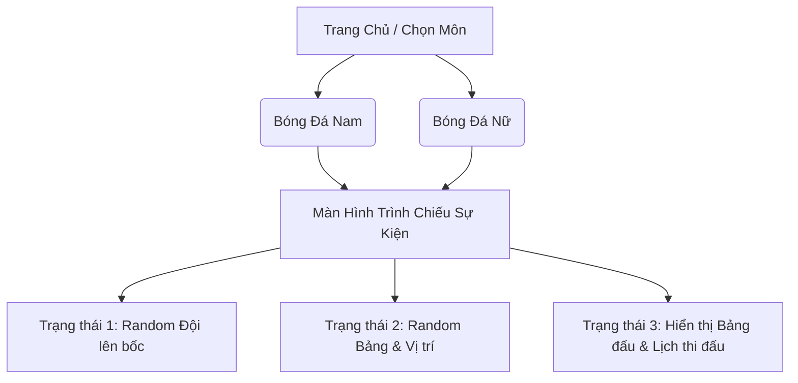
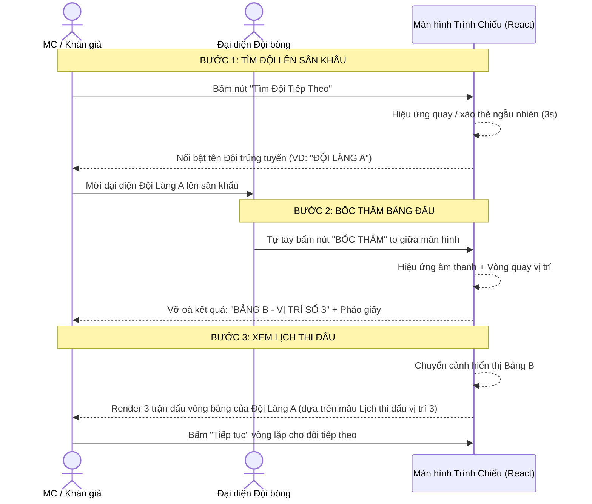

# Phase 1: Thiết kế Hệ Frontend (Mock Data)

## 1. Công nghệ sử dụng
- **Framework:** React (khởi tạo qua Vite để có tốc độ build cực nhanh).
- **Styling:** Vanilla CSS kết hợp CSS Modules (tạo hiệu ứng chuyển động, glassmorphism, responsive).
- **Thư viện phụ trợ (dự kiến):** `react-confetti` (hiệu ứng pháo giấy), các thư viện UI cho wheel/randomizer (nếu cần).
- **Dữ liệu:** Dùng mảng Object trong JavaScript (Mock Data) để mô phỏng Database.

## 2. Sơ đồ các trang (Page Structure)

## 3. Kịch bản Bốc Thăm (Flow Double Random)

Quá trình trên màn hình trình chiếu (kết nối máy chiếu) diễn ra theo các bước sau:

## 4. Danh sách công việc (Tasks Phase 1)
1. Dựng cấu trúc project `frontend` bằng Vite.
2. Xây dựng Mock Data JSON (16 đội nam, 8 đội nữ).
3. Code layout Màn hình tổng quan (Các bảng đấu A, B, C, D).
4. Code hiệu ứng Random Đội (chọn 1 phần tử trong mảng những đội chưa bốc).
5. Code hiệu ứng Random Vị trí (chọn 1 phần tử trong mảng các slot chưa có chủ).
6. Code hiển thị Lịch thi đấu tự động dựa trên Vị trí.
7. Đóng gói và chạy thử nghiệm thực tế (Mở full screen trên browser).
